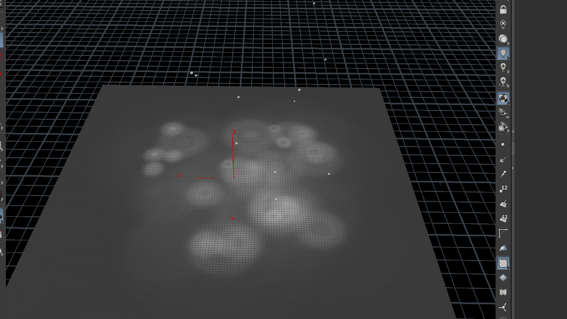

# LcLLib-for-Houdini

自定义Houdini HDA库，封装了一些自己常用的HDA节点，方便以后使用。顺便记录一下Houdini的一些知识点和Demo,方便以后查阅。

## 1. Houdini 自定义库安装教程

这里以我的自定义库`LcLLib-for-Houdini`为例。

1. 创建一个LcL.json文件，并将其放在Houdini的库文件夹中，例如:`C:\Users\Administrator\Documents\houdini19.0\packages`
2. 在LcL.json文件中添加以下内容：

```json
{
    "env": [
        {
            "LibPath": "F:/HoudiniProjects/libs"
        }
    ],
    "package_path" : [
        "$LibPath/packages",
        "$LibPath/LcLLib-for-Houdini/packages"
    ]
}
```

- `LibPath`为自定义库的路径。
- `package_path`为自定义库的子文件夹路径，可以有多个。

3. 在自定义库的packages文件夹中创建`LcLLib.json`文件


并添加以下内容：

```json

{
    "load_package_once": true,
    "path": [
        {        
            "value" : "$LibPath/LcLLib-for-Houdini",
            "method" : "prepend",
        },
    ],
    "env": [
        {
            "LcLLib": "$LibPath/LcLLib-for-Houdini"
        },
        {
            "HOUDINI_SCRIPT_PATH": {
                "method": "prepend",
                "value": [
                    "$LcLLib/scripts",
                ]
            }
        },
        {
            "HOUDINI_OTLSCAN_PATH": {
                "method": "append", 
                "value": [
                    "$LcLLib/otls/geo",
                    "$LcLLib/otls/grass",
                    "$LcLLib/otls/road",
                    "$LcLLib/otls/rock",
                    "$LcLLib/otls/terrain",
                    "$LcLLib/otls/tools",
                    "$LcLLib/otls/track",
                    "$LcLLib/otls/tree",
                ]
            }
        },
        {
            "HOUDINI_VEX_PATH": {
                "method": "append", 
                "value": [
                    "$LcLLib/vex/^",
                ]
            }
        },
        {
            "HOUDINI_OCL_PATH": {
                "method": "append", 
                "value": [
                    "$LcLLib/ocl",
                ]
            }
        },
    ],
}
```

- `load_package_once`为true时，只加载一次自定义库。
- `path`为自定义库的路径。
- `env`为自定义库的环境变量，可以有多个。

## 2. LcLLib-for-Houdini 的Example文件

### [雨滴水波模拟](https://github.com/csdjk/LcLLib-for-Houdini/tree/main/examples/water)



### [简单的烟雾模拟](https://github.com/csdjk/LcLLib-for-Houdini/tree/main/examples/smoke)


## 3. LcLLib-for-Houdini 的HDA节点

### [LcL Water Wave Tools](https://github.com/csdjk/LcLLib-for-Houdini/tree/main/otls/tools)

`HDA:   water_wave`

用于创建无缝FFT海水，可以通过修改参数来调整海水的大小、波长、波高、波速、波向、波的数量等。
支持导出序列帧法线贴图。


合成后的法线贴图（8x8）


### [LcL Noise Creator](https://github.com/csdjk/LcLLib-for-Houdini/tree/main/otls/tools)

`HDA:  noise_creator`

用于创建噪声贴图，支持多种噪声类型，例如Perlin、Worley、Voronoi、Cellular、Simplex、Value等。


### [LcL Gpa Data Importer](https://github.com/csdjk/LcLLib-for-Houdini/tree/main/otls/tools)

GPA截帧数据导入器，用于把GPA导出的CSV数据写入FBX中，例如uv、法线、顶点颜色等。
原本GPA导出的obj是没有uv等数据的。

csv文件格式：


写入FBX后的效果：


